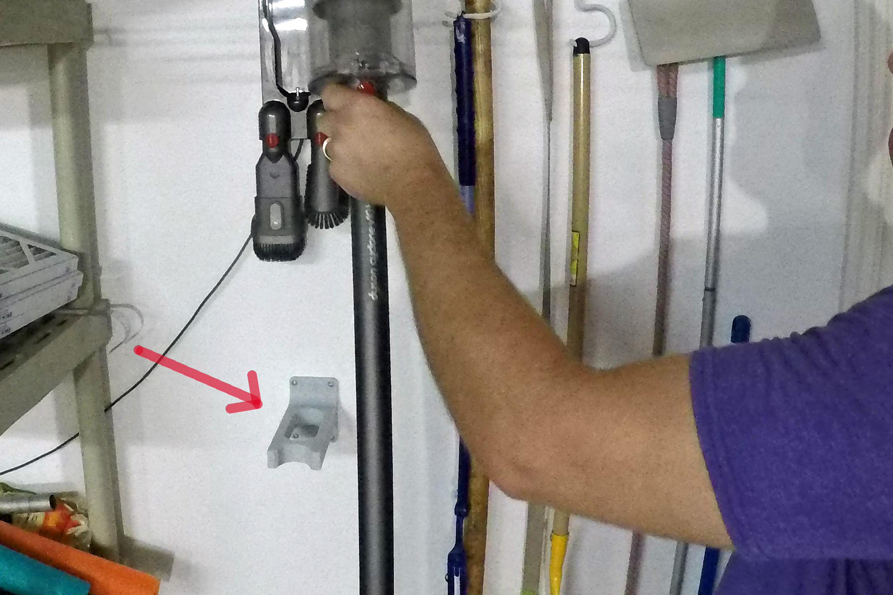
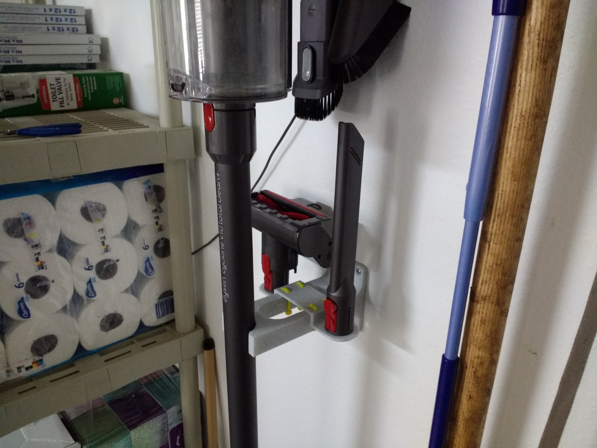
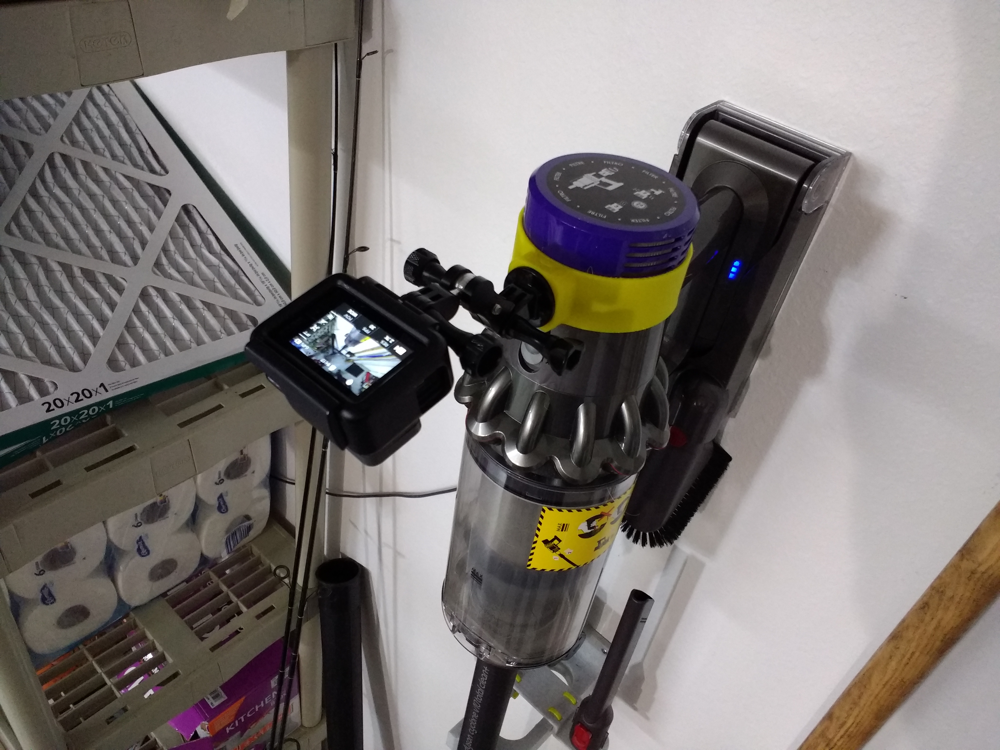

# Dyson-Support

[Build Video] (https://www.youtube.com/watch?v=HBelcYwwJto)(YouTube)

Wasn't satisfied with the way my vacuum cleaner could move around on its base, so created a holder for the bottom.

Vacuum is a [Dyson Cyclone V10 total clean+](https://amzn.to/2sMd589) (Amazon Affiliate).  
Purchased mine Costco, but it would seem that any V10 model should work (please let me know  
if you try it with this or other models: hi@jeremyscook.com

Short clip on Twitter: https://twitter.com/JeremySCook/status/1172189925464313856

Update: now with a tool holder that's printed separately, and attaches with zip ties:

Update 2: Added an FPV mount as [seen on Twitter](https://twitter.com/JeremySCook/status/1202614988210417670) as well.

